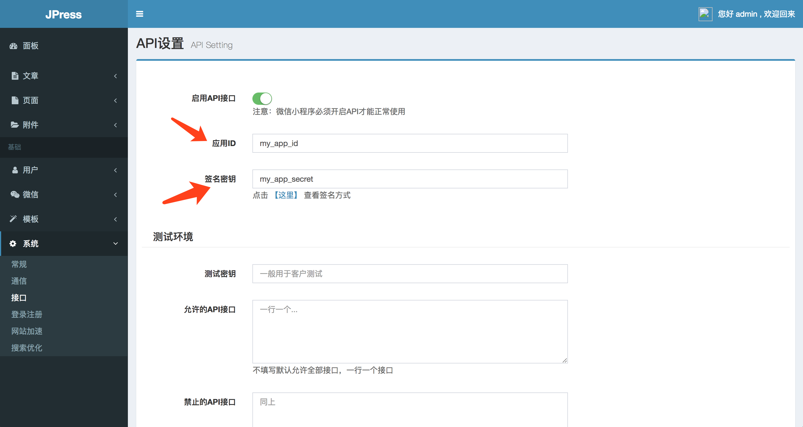

# JPress 微信小程序SDK

JPress 是一个类似 WordPress 的程序，并提供了良好的扩展和微服务与分布式的支持，因此理论支持任何并发流量。

JPress 网址： http://jpress.io 


## SDK 用法

### 初始化

SDK 需要在小程序启动的时候进行初始化，例如：

```js
App({
  onLaunch: function () {
       jpress.init({
         host:'http://jpress_web_url.com',
         app_id:'my_app_id',
         app_secret:'my_app_secret'
       })
   }
})   
```

以上的 `my_app_id` 和 `my_app_secret` 需要在后台填写（后台 -> 系统 -> 接口 ），如下图所示：



### 小程序用户登录和注册

**用户登录**

```js
wx.login({
  success: res => {
    jpress.wxLogin(res.code)
  }
})
```

**注册新用户或初始化当前用户**

微信小程序布局文件：

```html
<button  open-type="getUserInfo" bindgetuserinfo="getUserInfo"> 
获取用户信息 
</button>
```

js 处理：

```js
getUserInfo: function(e) {
    jpress.wxGetUserInfo(e.detail)
}
```

### SDK 方法列表

 

|  接口 | 描述 | 备注 |
| --- | --- | --- |
| init | 对JPress SDK 进行初始化 | 在小程序启动的时候调用  |
| createGetRequest | 构建一个Get API请求 |  |
| createPostRequest | 构建一个Post API请求 |  |
| createRequest | 构建一个API请求，默认是get请求 |  |
| wxLogin | 进行用户code初始化 |  |
| wxGetUserInfo | 进行用户注册 （如果当前用户没有注册，就会注册一个新的用户；如果用户已经注册，则初始化当前用户信息） |  |
| optionInfo | 获取网站配置信息 |  |
| userInfo | 通过用户ID获取用户信息 |  |
| myInfo | 获取当前登录的用户信息（我的信息） |  |
| userSave | 对用户信息进行保存 |  |
| articleInfo | 获取单篇文章信息 |  |
| articleList | 获取文章列表（固定数量，默认为10条数据） |  |
| articlePagination | 分页加载文章列表 |  |
| articleCategoryInfo | 获取网站的分类信息 |  |
| articleSave | 文章数据更新 |  |
| pageInfo | 获取单个页面信息 |  |
| pageList | 获取固定标识的页面列表 |  |


#### 获取当前用户信息（自己的信息）

```js
jpress.getMyInfo()
.then(data=>{
    console.log(data)//用户信息
})
.catch(data=>{
    console.log(data.message);//错误信息
})
```

#### 获取用户信息

获取id=123的用户信息

```js
jpress.getUser(123)
.then(data=>{
    console.log(data)//id=123的用户信息
})
.catch(data=>{
    console.log(data.message);//错误信息
})
```

#### 保存用户信息

```js
var userData = {
    id:123,
    nickname : "张三",
    email : "xxx@qq.com",  
}

jpress.doUserSave(userData)
.then(data=>{
    //保存成功
})
.catch(error=>{
    console.error(error.message)
})
```

其他方法参考SDK列表。


